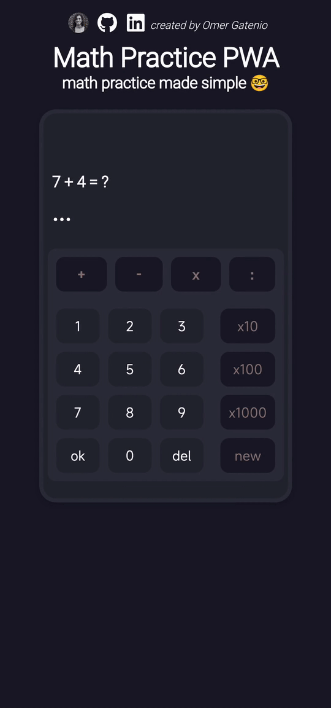

# Math Practice PWA
As part of my self-learning journey, in order to learn React better, I made a simple PWA without using any React Hooks or third party libraries.

I created this project using some of the knowledge I gained in:
- HTML
- CSS
- JavaScript
- React
- Graphic Design
- Git & Github

## About this app
Math Practice PWA is a simple math practice app in order to help people struggling with simple math calculations.

### Main Features:
- **Practice** addition, subtraction, multiplication, or division.
- **Improve** your level by practicing higher numbers (x10, x100, x1000)
- **Watch** your exercise history
- **Fix** your weaknesses by observing the 'trys' counter in each exercise.

This app works well with mouse, keyboard and touch input.

You can install this app on your machine locally, using it without internet connection.

.
.
.

I hope someone will find this app helpful, thank you for your time 😁

Live site: https://effervescent-cranachan-4a19d0.netlify.app/

Github repo: https://github.com/gateniomer/math-practice-app

